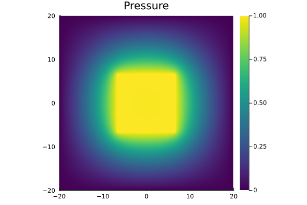

The present code solves the laplace equation $\triangle u=0$ inside of a 2D box so that $u(x)=0 \text{ for } x \in \partial D_{1}$ and with an inner box inside of it so that $u(x) = 1$ for $x \in D_{2}$. It uses the pseudo transient method explained in [Räss et. al](https://gmd.copernicus.org/articles/15/5757/2022/) and the [Parallel Stencil Package](https://github.com/omlins/ParallelStencil.jl) for Julia.

The final solution is displayed below:

Below you can see a .gif that shows the convergence towards a solution from a randomly initiated inital state:

The code works on GPUs as well as CPUs.